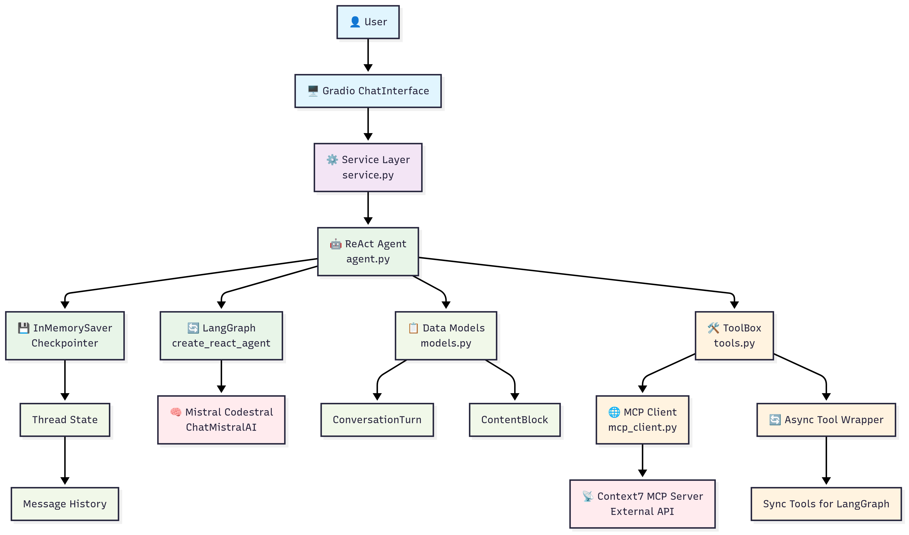

# 1. Overview

## 1.1 Introduction
Code4all is a local prototype of a ReAct-style agent that assists developers with LangGraph. It grounds answers in LangGraph docs via the Context7 MCP server and exposes a simple Gradio UI. Conversational memory is included as short-term session state.

## 1.2 High-Level Architecture
- Monolithic Python app, runs locally.
- ReAct Agent (LangGraph) with tools:
  - `documentation_search` (via MCP client)
  - `code_generator` (LLM-backed)
- UI: Gradio Blocks.
- Memory: Session-scoped conversation window managed by LangGraph.

### Diagram

## 1.3 Components (at a glance)
- UI Presentation Layer: `src/ui/interface.py`
- Agent Service Layer: `src/service.py`
- ReAct Agent: `src/agent/agent.py`
- Tools: `src/agent/tools.py`
- MCP Client: `src/client/mcp_client.py`
