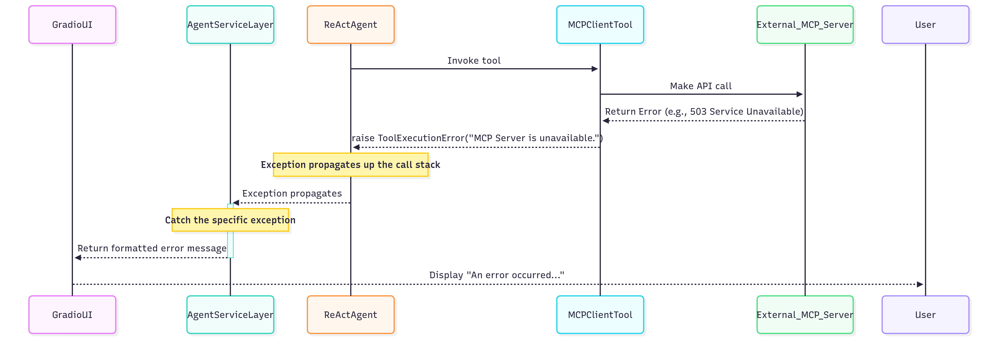

# 5. Quality & Operations

## 5.1 Security
- Load `MCP_API_KEY` from `.env`; never hardcode secrets.

## 5.2 Performance
- Target P95 < 10s.
- Use async I/O for network calls; cache session context.

## 5.3 Testing Strategy
- Pytest unit tests for agent, tools, client.
- Manual verification for Gradio UI.

## 5.4 Coding Standards
- PEP 8; type hints everywhere; Pydantic for models.

## 5.5 Error Handling
- Raise `ToolExecutionError` for tool/client failures.
- `AgentServiceLayer` catches and returns user-friendly messages.

## 5.6 Monitoring & Observability
- Log ReAct thoughts/actions to console and UI trace area.

## 5.7 Deployment
- Local-only for MVP; no cloud deploy.

## 5.8 Checklist
- Architecture readiness: High.
- Open item: Formalize MCP API details (host, endpoints, schema).
